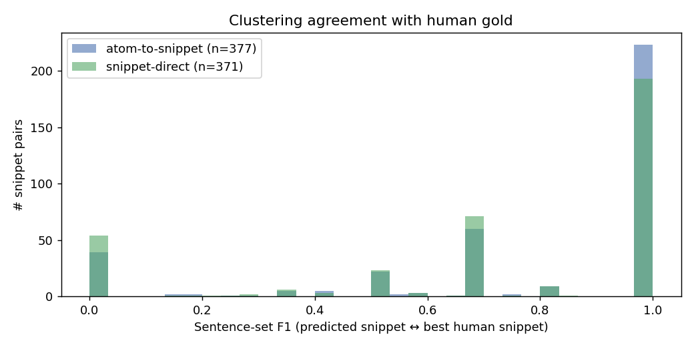
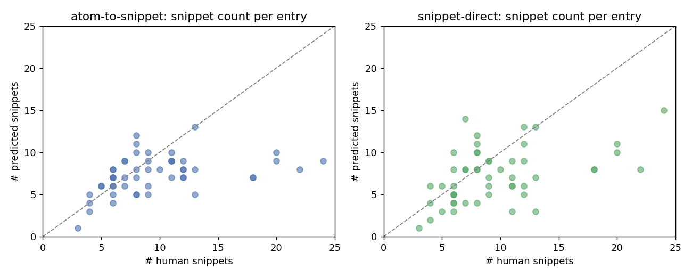

# Snippet Processor — Sentence-Grounded Evaluation

Evaluated **51** entries against human gold (data/3-annotated/medqa.json).

Evaluation currency: **sentence indices** into a deterministic segmentation of `full_text` (see sentence_utils.py). Gold atoms are pre-mapped to sentence indices once (sentence_alignment.json), so all snippet comparisons are on the same currency — no embedding alignment.

## Pipelines

| Mode | Input | API calls | Role |
|---|---|---|---|
| **atom-to-snippet** | `(query, full_text)` | **2** | Default. Sentence-split → extract atoms (+ shared_context) → cluster atoms into snippets. Mirrors the human annotation workflow. |
| **snippet-direct** | `(query, full_text)` | **1** | Single-pass: sentences directly to snippets + shared_context. Cheaper; slightly weaker on dense consumer responses. |

## Headline numbers (sentence-set F1)

| Mode | sent F1 | sent P | sent R | embed cos | ROUGE-L | n pred / human |
|---|---|---|---|---|---|---|
| atom-to-snippet | **0.772** | 0.754 | 0.862 | 0.814 | 0.571 | 377 / 494 |
| snippet-direct | **0.721** | 0.704 | 0.814 | 0.795 | 0.564 | 371 / 494 |

## By subset

| Mode | consumer F1 | vignette F1 |
|---|---|---|
| atom-to-snippet | 0.925 | 0.638 |
| snippet-direct | 0.877 | 0.637 |
