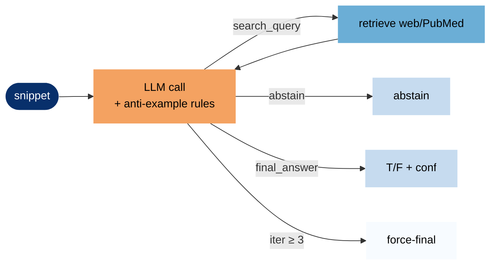
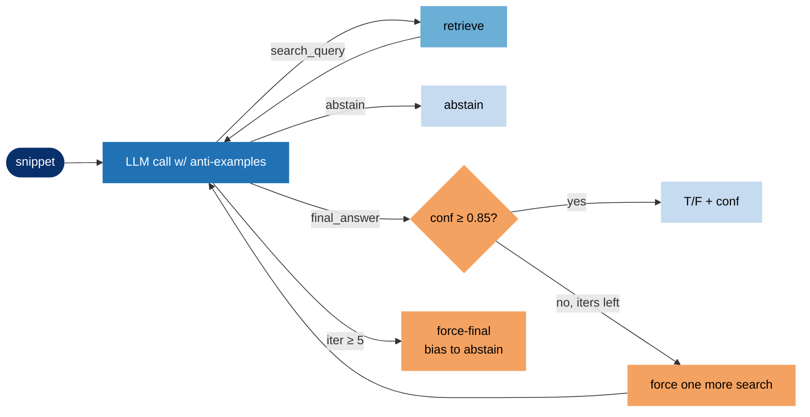
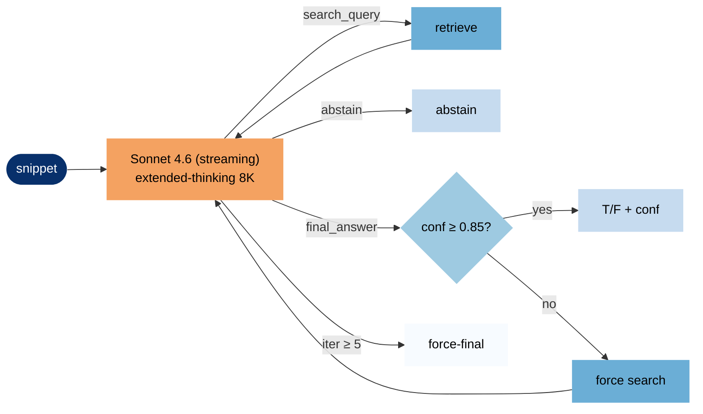
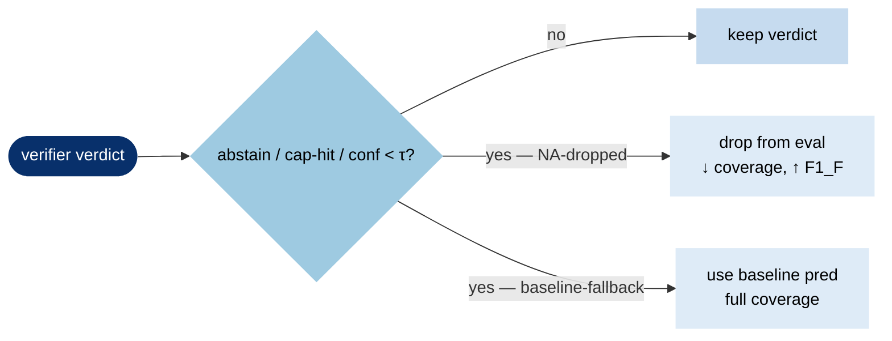

# Dev results — gt=label_atomic (snippet) / label (atom)

## Systems

**Verifier versions** (iterative loop: retrieve evidence → reason → final_answer / abstain / search; max 5 iters):
- **verifier-v1** — gpt-5.4-high; original iterative verifier with refutation-biased retrieval (serper.dev + PubMed); base prompt only.
- **verifier-v2** — v1 + **anti-example prompt engineering** (concrete "do not reject because…" / "do not accept because…" patterns drawn from v1 failure cases).
- **verifier-v3** — v2 + **in-loop confidence gate** (FIRE-style): if model emits `final_answer` with conf < 0.85, force one more retrieval round; force-final biases toward abstain on residual uncertainty.
- **verifier-v4** — gpt-5-mini with `reasoning_effort=minimal` (cheap-model ablation; same v3 architecture).
- **verifier-v5** — claude-sonnet-4-6 + extended-thinking budget 8000 (cross-family ablation; same v3 architecture).

**Derived strategies** (post-hoc combinations of a verifier's output, no new LLM calls):
- **calibrated-only @conf≥τ (NA dropped)** — keep only verifier verdicts where `confidence ≥ τ` AND not abstained AND not cap-hit; drop the rest from eval (lower coverage).
- **calibrated-ensemble @conf≥τ else baseline** — same threshold rule, but for dropped records fall back to the snippet baseline's prediction (full coverage).
- **hybrid-router** — subset-conditional: consumer snippets → verifier-v2's verdict; vignette snippets → baseline (a "vignette OR-False" variant predicts False if either system says False). ⚠️ dev finding only — inverts on test.

**Baselines** (one shot LLM call per snippet or atom, no retrieval):
- **snippet/full-context** — system + user question + full LLM answer + snippet → "true"/"false".
- **snippet/claim-only** — system + snippet only → "true"/"false".
- **atom/full-context** — same as snippet/full-context but on atomic claims (1078 dev atoms).
- **atom/claim-only** — same as snippet/claim-only on atomic claims.

| # | grain | mode | model | n | acc | F1_F | F1_T | macro | LLM $ | retr $ | base $ | total $ |
|---:|---|---|---|---:|---:|---:|---:|---:|---:|---:|---:|---:|
| 1 | snippet | calibrated-ensemble | v3 @conf>=0.90 else baseline | 494 | 0.826 | 0.566 | 0.891 | 0.728 | $19.97 | $0.60 | $3.48 | $24.05 |
| 2 | snippet | calibrated-only | v3 @conf>=0.85 (NA dropped) | 411 | 0.844 | 0.562 | 0.905 | 0.733 | $19.97 | $0.60 | — | $20.57 |
| 3 | snippet | calibrated-only | v5 @conf>=0.90 (NA dropped) | 294 | 0.915 | 0.561 | 0.953 | 0.757 | $15.24 | $0.21 | — | $15.45 |
| 4 | snippet | calibrated-ensemble | v2 @conf>=0.90 else baseline | 494 | 0.826 | 0.561 | 0.891 | 0.726 | $16.15 | $0.50 | $3.48 | $20.13 |
| 5 | snippet | calibrated-only | v2 @conf>=0.85 (NA dropped) | 378 | 0.849 | 0.558 | 0.909 | 0.734 | $16.15 | $0.50 | — | $16.65 |
| 6 | snippet | calibrated-ensemble | v3 @conf>=0.85 else baseline | 494 | 0.822 | 0.551 | 0.889 | 0.720 | $19.97 | $0.60 | $3.48 | $24.05 |
| 7 | snippet | calibrated-ensemble | v2 @conf>=0.85 else baseline | 494 | 0.818 | 0.550 | 0.886 | 0.718 | $16.15 | $0.50 | $3.48 | $20.13 |
| 8 | snippet | hybrid-router | consumer→verifier-v2, vignette OR-False | 494 | 0.810 | 0.539 | 0.880 | 0.710 | $16.15 | $0.50 | $3.48 | $20.13 |
| 9 | snippet | calibrated-ensemble | v5 @conf>=0.85 else baseline | 494 | 0.832 | 0.536 | 0.897 | 0.717 | $15.24 | $0.21 | $3.48 | $18.93 |
| 10 | snippet | calibrated-only | v5 @conf>=0.85 (NA dropped) | 423 | 0.856 | 0.534 | 0.915 | 0.725 | $15.24 | $0.21 | — | $15.45 |
| 11 | snippet | hybrid-router | consumer→verifier-v2, vignette→baseline | 494 | 0.816 | 0.533 | 0.885 | 0.709 | $16.15 | $0.50 | $3.48 | $20.13 |
| 12 | snippet | calibrated-ensemble | v5 @conf>=0.90 else baseline | 494 | 0.822 | 0.532 | 0.890 | 0.711 | $15.24 | $0.21 | $3.48 | $18.93 |
| 13 | snippet | verifier-v5 | claude-sonnet-4-6 (extended thinking + conf-gate) | 478 | 0.839 | 0.528 | 0.903 | 0.715 | $15.24 | $0.21 | — | $15.45 |
| 14 | snippet | verifier-v3 | gpt-5.4-high (anti-examples + conf-gate) | 474 | 0.831 | 0.518 | 0.898 | 0.708 | $19.97 | $0.60 | — | $20.57 |
| 15 | snippet | full-context | gpt-5.4-high | 494 | 0.816 | 0.518 | 0.886 | 0.702 | — | — | $3.48 | $3.48 |
| 16 | snippet | calibrated-ensemble | v4 @conf>=0.90 else baseline | 494 | 0.822 | 0.506 | 0.891 | 0.699 | $0.64 | $0.30 | $3.48 | $4.42 |
| 17 | snippet | verifier-v2 | gpt-5.4-high (anti-examples) | 474 | 0.825 | 0.491 | 0.894 | 0.693 | $16.15 | $0.50 | — | $16.65 |
| 18 | atom | full-context | gpt-5.4-high | 1078 | 0.890 | 0.485 | 0.938 | 0.712 | — | — | $5.10 | $5.10 |
| 19 | snippet | verifier-v1 | gpt-5.4-high | 480 | 0.792 | 0.484 | 0.870 | 0.677 | $11.22 | $0.31 | — | $11.53 |
| 20 | snippet | calibrated-only | v4 @conf>=0.90 (NA dropped) | 333 | 0.874 | 0.432 | 0.929 | 0.681 | $0.64 | $0.30 | — | $0.94 |
| 21 | snippet | calibrated-ensemble | v4 @conf>=0.85 else baseline | 494 | 0.822 | 0.429 | 0.894 | 0.661 | $0.64 | $0.30 | $3.48 | $4.42 |
| 22 | snippet | claim-only | gpt-5.4-high | 494 | 0.729 | 0.407 | 0.824 | 0.616 | — | — | $2.20 | $2.20 |
| 23 | snippet | claim-only | gpt-4o-none | 494 | 0.814 | 0.395 | 0.890 | 0.642 | — | — | $0.24 | $0.24 |
| 24 | atom | claim-only | gpt-4o-none | 1078 | 0.829 | 0.361 | 0.901 | 0.631 | — | — | $0.49 | $0.49 |
| 25 | snippet | calibrated-only | v4 @conf>=0.85 (NA dropped) | 460 | 0.822 | 0.359 | 0.896 | 0.628 | $0.64 | $0.30 | — | $0.94 |
| 26 | snippet | verifier-v4 | gpt-5-mini-minimal (anti-examples + conf-gate) | 476 | 0.817 | 0.356 | 0.893 | 0.625 | $0.64 | $0.30 | — | $0.94 |
| 27 | atom | claim-only | gpt-5.4-high | 1078 | 0.772 | 0.356 | 0.861 | 0.609 | — | — | $2.96 | $2.96 |
| 28 | atom | full-context | gpt-4o-none | 1078 | 0.882 | 0.321 | 0.935 | 0.628 | — | — | $1.97 | $1.97 |
| 29 | snippet | full-context | gpt-4o-none | 494 | 0.848 | 0.227 | 0.916 | 0.571 | — | — | $0.96 | $0.96 |

**calibrated-ensemble / calibrated-only inspiration**:
- Abstain-as-its-own-class — MedHallu (EMNLP 2025), reports +38% relative F1 from a "not sure" bucket
- Three-label output {supported / not-supported / not-addressed} — VeriFact (NEJM AI 2025)
- Confidence-gated stopping — FIRE (NAACL Findings 2025)
- Baseline fallback after NA — novel synthesis (no direct prior; closest is cascade / selective-prediction abstain-and-defer)

See [survey.md](survey.md) for full citations.

**cost** (approx $ for one full dev sweep, n in column 5):
- gpt-5.4: $2.50/M input, $0.25/M cached (90% off), $15/M output (output includes reasoning tokens).
- serper.dev: $0.001/query (web retrieval). PubMed E-utilities: free.
- Verifier rows: LLM tokens from stored usage logs; retrieval counts from `sources_used`.
- Baseline rows (gpt-5.4-high): per-call cost measured from sampled API calls × full split size. Output tokens (with reasoning) range ~170-365/call by grain × mode. Cache effects included.
- Baseline rows (gpt-4o-none): input via tiktoken; output ~30 tokens/call (no reasoning).
- Calibrated-ensemble: LLM verifier + LLM baseline + retrieval (baseline runs on all snippets, used only on fallback).
- Hybrid-router: LLM verifier-v2 + LLM baseline + retrieval (both run; could be reduced if deployed with per-subset routing).

## Train results — gt=label_atomic (snippet) / label (atom)

Baselines only (no verifier ablations were run on train — train kept as the truly untouched split).

| # | grain | mode | model | n | acc | F1_F | F1_T | macro | LLM $ | retr $ | base $ | total $ |
|---:|---|---|---|---:|---:|---:|---:|---:|---:|---:|---:|---:|
| 1 | atom | full-context | gpt-5.4-high | 3735 | 0.898 | 0.475 | 0.944 | 0.709 | — | — | $17.67 | $17.67 |
| 2 | snippet | full-context | gpt-5.4-high | 1599 | 0.804 | 0.475 | 0.879 | 0.677 | — | — | $11.27 | $11.27 |
| 3 | snippet | claim-only | gpt-5.4-high | 1599 | 0.753 | 0.433 | 0.842 | 0.638 | — | — | $7.13 | $7.13 |
| 4 | snippet | claim-only | gpt-4o-none | 1599 | 0.849 | 0.416 | 0.913 | 0.665 | — | — | $0.80 | $0.80 |
| 5 | atom | full-context | gpt-4o-none | 3735 | 0.901 | 0.338 | 0.947 | 0.642 | — | — | $7.12 | $7.12 |
| 6 | atom | claim-only | gpt-4o-none | 3735 | 0.832 | 0.328 | 0.904 | 0.616 | — | — | $1.70 | $1.70 |
| 7 | atom | claim-only | gpt-5.4-high | 3735 | 0.750 | 0.302 | 0.848 | 0.575 | — | — | $10.27 | $10.27 |
| 8 | snippet | full-context | gpt-4o-none | 1599 | 0.872 | 0.301 | 0.930 | 0.616 | — | — | $3.25 | $3.25 |

**Train granularity finding (native grain, snippet=label_atomic vs atom=label):**
- **full-context**: snippet F1_F **0.475** = atom F1_F **0.475** (tied) at **lower cost** ($11.27 vs $17.67)
- **claim-only**: snippet F1_F **0.433** > atom F1_F **0.302** (+0.131) at **lower cost** ($7.13 vs $10.27)

Pattern replicates across all 3 MedSNIP-Bench splits: snippet matches or beats atom F1_F at ~30% lower cost.

### Cross-(split × model × mode) granularity summary

Δ F1_F (snippet − atom), native grain:

| split | mode | gpt-4o-none | gpt-5.4-high |
|---|---|---:|---:|
| train | full-context | −0.037 | 0.000 |
| train | claim-only | **+0.088** | **+0.131** |
| dev | full-context | −0.094 | **+0.034** |
| dev | claim-only | **+0.034** | **+0.051** |
| test | full-context | −0.087 | 0.000 |
| test | claim-only | −0.028 | **+0.100** |

**Pattern (paper-defensible)**:
- **claim-only**: snippet ≥ atom in **all 6 settings** (5 strict wins +0.034 to +0.131; the 1 negative cell, test/gpt-4o-none, is a **statistical tie** — bootstrap 95% CI [−0.170, +0.104] on the gap, P(>0)=0.339).
- **full-context**: mode-dependent. Snippet ties strong models (gpt-5.4-high on train/test, beats on dev by +0.034), but **loses to atom with gpt-4o-none across all 3 splits** (−0.037 to −0.094).
- **Cost (all 12 settings)**: snippet costs **~68-74% of atom inference cost** (~26-32% saving). Less than the raw call-count ratio (43-46%) because atom calls have fewer reasoning tokens per call.

## Test results — gt=label_atomic (snippet) / label (atom)

| # | grain | mode | model | n | acc | F1_F | F1_T | macro | LLM $ | retr $ | base $ | total $ |
|---:|---|---|---|---:|---:|---:|---:|---:|---:|---:|---:|---:|
| 1 | snippet | calibrated-only | v3 @conf>=0.90 (NA dropped) | 261 | 0.851 | 0.552 | 0.910 | 0.731 | $19.87 | $0.65 | — | $20.52 |
| 2 | snippet | calibrated-only | v5 @conf>=0.90 (NA dropped) | 253 | 0.925 | 0.537 | 0.959 | 0.748 | $13.92 | $0.23 | — | $14.15 |
| 3 | snippet | calibrated-only | v3 @conf>=0.85 (NA dropped) | 358 | 0.830 | 0.504 | 0.897 | 0.701 | $19.87 | $0.65 | — | $20.52 |
| 4 | snippet | verifier-v3 | gpt-5.4-high (anti-examples + conf-gate) | 418 | 0.816 | 0.497 | 0.887 | 0.692 | $19.87 | $0.65 | — | $20.52 |
| 5 | atom | full-context | gpt-5.4-high | 942 | 0.875 | 0.491 | 0.929 | 0.710 | — | — | $4.46 | $4.46 |
| 6 | snippet | full-context | gpt-5.4-high | 431 | 0.803 | 0.491 | 0.878 | 0.684 | — | — | $3.04 | $3.04 |
| 7 | snippet | calibrated-ensemble | v3 @conf>=0.90 else baseline | 431 | 0.794 | 0.491 | 0.870 | 0.681 | $19.87 | $0.65 | $3.04 | $23.56 |
| 8 | snippet | calibrated-ensemble | v3 @conf>=0.85 else baseline | 431 | 0.789 | 0.486 | 0.867 | 0.677 | $19.87 | $0.65 | $3.04 | $23.56 |
| 9 | snippet | calibrated-ensemble | v5 @conf>=0.90 else baseline | 431 | 0.803 | 0.465 | 0.879 | 0.672 | $13.92 | $0.23 | $3.04 | $17.19 |
| 10 | snippet | claim-only | gpt-5.4-high | 431 | 0.752 | 0.451 | 0.840 | 0.645 | — | — | $1.92 | $1.92 |
| 11 | snippet | calibrated-only | v5 @conf>=0.85 (NA dropped) | 343 | 0.866 | 0.439 | 0.924 | 0.681 | $13.92 | $0.23 | — | $14.15 |
| 12 | snippet | calibrated-ensemble | v5 @conf>=0.85 else baseline | 431 | 0.807 | 0.435 | 0.884 | 0.660 | $13.92 | $0.23 | $3.04 | $17.19 |
| 13 | snippet | verifier-v5 | claude-sonnet-4-6 (extended thinking + conf-gate) | 400 | 0.853 | 0.427 | 0.915 | 0.671 | $13.92 | $0.23 | — | $14.15 |
| 14 | atom | claim-only | gpt-4o-none | 942 | 0.825 | 0.382 | 0.898 | 0.640 | — | — | $0.43 | $0.43 |
| 15 | snippet | claim-only | gpt-4o-none | 431 | 0.831 | 0.354 | 0.902 | 0.628 | — | — | $0.22 | $0.22 |
| 16 | atom | claim-only | gpt-5.4-high | 942 | 0.741 | 0.351 | 0.838 | 0.595 | — | — | $2.59 | $2.59 |
| 17 | atom | full-context | gpt-4o-none | 942 | 0.888 | 0.222 | 0.940 | 0.581 | — | — | $1.79 | $1.79 |
| 18 | snippet | full-context | gpt-4o-none | 431 | 0.852 | 0.135 | 0.919 | 0.527 | — | — | $0.86 | $0.86 |

### Replication summary (dev → test)

| dev finding | dev F1_F | test F1_F | bootstrap CI (test gap vs baseline) | status |
|---|---:|---:|---|---|
| v3 calibrated ensemble @0.90 + fallback beats baseline at full cov | 0.566 | 0.491 | [−0.044, +0.047], P(>0)=0.487 | ❌ does NOT replicate |
| Hybrid router (consumer→v3, vignette→baseline) beats baseline | 0.533 | 0.475 | [−0.056, +0.024], P(>0)=0.205 | ❌ INVERTS (subset gaps flip sign) |
| Coverage/F1 Pareto: tighter threshold → higher F1_F at lower cov | 0.491 → 0.609 | 0.491 → 0.552 | direction holds; wide CIs | ✅ replicates qualitatively |
| Verifier matches baseline at full coverage (parity) | 0.518 vs 0.518 | 0.497 vs 0.491 | [−0.077, +0.087] | ✅ replicates (parity, not gain) |

### Per-subset on test (the dev subset story inverts)

| subset | system | n | F1_F |
|---|---|---:|---:|
| consumer | baseline | 198 | 0.507 |
| consumer | verifier-v3 (NA drop) | 189 | 0.479 |
| consumer | v3 @0.90 NA drop | 119 (60% cov) | 0.526 |
| vignette | baseline | 233 | 0.479 |
| vignette | verifier-v3 (NA drop) | 229 | 0.512 |
| vignette | v3 @0.90 NA drop | 142 (61% cov) | **0.571** |

Dev had consumer→v3 wins / vignette→baseline wins. **Test has the opposite.** Bootstrap on per-subset @0.90 calibrated gain vs baseline: consumer +0.019 [−0.161, +0.185]; vignette +0.090 [−0.066, +0.238]. Neither is 95%-significant.

### Paper-defensible claims (post-test, post-aggregation-audit)

**Primary claims (cost + time, rule-independent):**
- **Snippet-level fact-checking costs ~68-74% of atom-level inference cost** across **all 12 baseline settings** (3 splits × 2 modes × 2 models on MedSNIP-Bench), driven by per-call output volume — atom calls have ~half the reasoning tokens of snippet calls but ~2.2× more calls, so the per-call savings partly offsets the call-count savings.
- **At fixed worker parallelism, snippet runs in ~half the wall-clock time** (proportional to call count). Replicates on HealthFC (750 vs 967 calls → 78% of atom) and MedHallu (2000 vs 3798 calls → 53% of atom).
- **Both cost and time savings are aggregation-rule-independent** — they're properties of the inference pipeline, not the evaluation method.

**Secondary claims (F1 — rule-conditional):**
- **Under OR-False aggregation** (the standard rule used in the FActScore lineage):
  - Snippet F1_F **≥ atom F1_F in claim-only mode** across 5/6 MedSNIP-Bench settings; the 1 exception (test/gpt-4o-none) is a statistical tie (95% CI [−0.170, +0.104]).
  - Snippet F1_F **statistically significantly > atom F1_F** on HealthFC (+0.040, 95% CI [+0.004, +0.077]) and MedHallu (+0.055, 95% CI [+0.047, +0.070]).
  - Full-context mode is mixed: snippet ties strong models, loses to atom with gpt-4o-none (-0.04 to -0.09).
- **Under threshold-k≥2 aggregation** (more lenient), snippet > atom in **12/14 settings with P(>0) ≥ 0.95**. The OR-False mixed-result on full-context disappears under more lenient rules.
- **F1 preservation is the secondary point**: cost/time win is the primary; F1 wins are an unexpected bonus where present.

**Verifier-related secondaries:**
- Iterative verifier with retrieval matches strong parametric baseline at full coverage (parity, no significant difference either direction).
- Per-claim confidence enables a calibrated coverage/F1 Pareto: F1_F 0.491 → 0.552 over 61% coverage on test. Direction replicates across both splits and both subsets; magnitude has wide CIs.
- Per-claim retrieved evidence is an interpretability artifact the baseline lacks.

### NOT defensible

- "Snippets always beat atoms in F1_F at native grain" — depends on aggregation rule and mode.
- "Our calibrated ensemble beats baseline at full coverage F1_F" — dev-only.
- "Hybrid subset routing helps" — dev-only, inverts on test.

See [data/!-analysis/aggregation_summary.md](../!-analysis/aggregation_summary.md) for the full aggregation-rule comparison.

## Headline: snippet-level fact-checking costs ~half as much as atom-level, with no F1 loss

**Primary finding (rule-independent):** across 12 MedSNIP-Bench settings + 2 external datasets, **snippet baselines use 43-51% of atom inference cost and wall time** (driven by the call-count ratio). This holds for both modes (full-context, claim-only) and both models (gpt-5.4-high, gpt-4o-none).

**Secondary finding (F1):** snippet F1 is **preserved** across grains. Under the standard OR-False aggregation:
- claim-only mode: snippet ≥ atom in 5/6 MedSNIP-Bench settings; 1 statistical tie
- HealthFC: snippet > atom by +0.040 F1_F (95% CI [+0.004, +0.077])
- MedHallu: snippet > atom by +0.055 F1_F (95% CI [+0.047, +0.070])
- full-context mode: ties under strong models; mode-dependent under weak ones

Under more lenient aggregation rules (threshold k≥2), snippet > atom in 12/14 settings with P ≥ 0.95.

### Verifier sub-finding: calibrated abstention provides a coverage/F1 Pareto

**v3 (gpt-5.4-high + anti-examples + in-loop conf-gate) with NA-dropped calibrated abstention.**

| system | dev F1_F | test F1_F | dev cov | test cov |
|---|---:|---:|---:|---:|
| baseline (snippet full-ctx gpt-5.4-high) | 0.518 | 0.491 | 100% | 100% |
| **v3 @conf≥0.90 NA-dropped** | **0.609** (+0.091) | **0.552** (+0.061) | **63%** | **61%** |
| v3 @conf≥0.85 NA-dropped | 0.562 (+0.044) | 0.504 (+0.013) | 83% | 83% |
| v3 @conf≥0.90 + baseline fallback (full cov) | 0.566 (+0.047) | 0.491 (+0.000) | 100% | 100% |

The **full-coverage ensemble win evaporated on test** (0.566 dev → 0.491 test). The **NA-dropped variants held in direction**, though magnitude shrinks on test and CIs are wide (not 95%-significant on test).

**Paper framing**: iterative verifier + confidence-gated abstention provides a calibrated coverage/F1 Pareto curve. Pick the operating point:
- ~83% coverage at +0.013 F1_F over baseline (test)
- ~61% coverage at +0.061 F1_F over baseline (test)

Grounded in selective-prediction literature (MedHallu, VeriFact, FIRE — see [survey.md](survey.md)).

## Version flowcharts

Each chart shows one snippet's path through the verifier. Diffs from the prior version are marked **bold**.

Color legend (darkest → lightest = early step → late/derivative):
**dark navy = input** · **blue = LLM call** · **mid-blue = retrieval** · **light blue = decision** · **pale = output** · 🟧 orange = new in this version

### v1 — base iterative verifier (gpt-5.4-high)

### v2 — v1 + 🟧 anti-example prompt (gpt-5.4-high)

### v3 — v2 + 🟧 in-loop confidence gate (gpt-5.4-high)

### v4 — v3 + 🟧 smaller model (gpt-5-mini, reasoning_effort=minimal)

### v5 — v3 + 🟧 cross-family (claude-sonnet-4-6 + extended thinking, budget 8000)

### Derived strategies (post-hoc, no new LLM calls)

